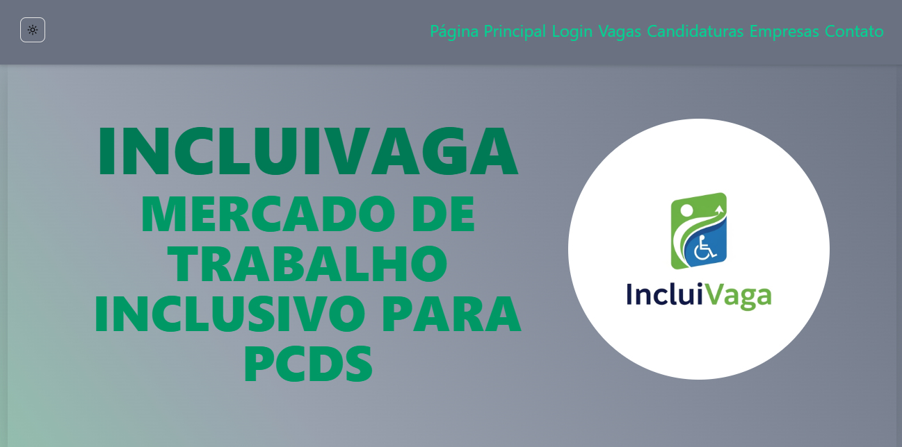

# Projeto Front-end - IncluiVaga 👨‍🦽


Projeto desenvolvido como projeto final de módulo e comclução do instituto Programadores do Amanhã. Sendo proposto uma aplicação full-stack nesse repositori foi desenvolvido a parte visual da aplicação sendo organizado com 7 paginas uma sendo a de não encontrado(not-faound 404) personalizada de forma amigavel e simples. 

## ❗ Problematização
Pessoas com Deficiência (PCDs) enfrentam dificuldades para acessar oportunidades no mercado de trabalho devido à falta de vagas inclusivas e processos seletivos inadequados. O que acaba impedindo profissionais qualificados de se aplicarem no mercado de trabalho.

## 💡 Solução Encontrada
Unindo uma aplicação back-end de outra equipe no desenvolvimento de uma API e a implementação de um front-end, criamos uma aplicação full-stack com a missão de facilitar o acesso e visibilidade de empresas que apoião e incentivam por mais vagas inclusivas e justas.

## 🧰 Tecnologias Utilizadas
| Tecnologias | Versão                |
|-------------|-----------------------|
| React       | 19.1.0                |
| Next.js     | 15.4.1                |
| TypeScript  | 5.8.3                 |
| TaiwindCSS  | 4.1.11                |
| Axios       | 1.10.0                |
| Vercel      | 44.2.13               |
| Git         | 2.46.0                |
| ShadCN      | 1.2.3, 0.525.0, 0.7.1 |


## 📝 Pré-Requesitos
Para utlizar essa aplicação com o funcionanmento esperado é necessario baixar alguns requesitos
- [Nodejs](https://nodejs.org/pt/download) Versão 20+

## ✅ Passo a Passo para Instalação
- 1 - Primeiro você vai precisar clonar o projeto no repositorio com esse codigo na sua máquina
```
git clone https://github.com/JeronimoSantos/projeto-final-front-05.git
```

- 2 - Entre na pasta do projeto
```
cd projeto-final-front-05
```

- 3 - Instale todas as dependencias da aplicação
```
npm install
```

- 4 - Para rodar a aplicação em desenvolvimento
```
npm run dev
```

## 🔗 Link da Api utilizada
- [Api IncluiVaga](https://github.com/JeronimoSantos/projeto-final-api-05)

## 📷 Imagens do Projeto


###


## 👥 Squad de Desenvolvimento M05

Equipe da Squad 5, comprometida com impacto social, acessibilidade e inclusão digital.

| Nome             | Função              |
|------------------|---------------------|
| [Jerônimo Santos Rodrigues](https://github.com/JeronimoSantos) | Líder     |
| [Flaviano Kiffer Teodoro](https://github.com/FK1FF3R)    | Colaborador/a |
| [Jair Bonifacío moreira filho](https://github.com/Jairfilhobonifacio) | Colaborador/a |
| [Emilly Santos Silva](https://github.com/emil1y)        | Colaborador/a |
| [Leiliane Nogueira Pinto Cavalcante](https://github.com/leilianecavalcante) | Colaborador/a |
| [Maria Eduarda Silva Souza](https://github.com/Mariaeduardamatias)  | Colaborador/a |

## Licença

Este projeto está licenciado sob a Licença MIT - veja o arquivo [LICENSE](LICENSE) para mais detalhes.